# 🧩 Working with Kubernetes Pods

(With Advanced Extension: Deployments & ReplicaSets)

## 📌 Project Overview

This project demonstrates practical, hands-on experience working with Kubernetes Pods, the smallest and most fundamental unit of deployment in Kubernetes.

The project begins with standalone Pods to build foundational understanding and is later extended with Deployments and ReplicaSets to demonstrate how real-world, production-grade Kubernetes workloads are managed.

This progression mirrors how Kubernetes is learned and used in professional DevOps environments.

## 🎯 Project Objectives

By completing this project, the following Kubernetes concepts are demonstrated:

Creating and managing Pods

Inspecting Pod configuration and lifecycle

Viewing application logs

Using labels and selectors

Understanding Pod ephemerality

Cleaning up Kubernetes resources

(Advanced) Managing workloads with Deployments & ReplicaSets

(Advanced) Self-healing, scaling, and rolling 
updates

## 🧱 Understanding Containers Inside Pods

A Kubernetes Pod is not a container itself, but a **logical wrapper around one or more containers**.

Within a Pod:
- Containers share the **same network namespace**
  - Same IP address
  - Same port space
- Containers can communicate with each other using `localhost`
- Containers can share **volumes** for data exchange
- Containers are scheduled and managed **as a single unit**

In this project, each Pod runs a single Nginx container to focus on core Pod behavior.  
However, Kubernetes Pods are commonly used to run **multiple tightly coupled containers**, such as:
- Application container + logging sidecar
- Application container + metrics exporter

This design explains why Pods—not containers—are the smallest deployable unit in Kubernetes.

## 🏷️ Labels and Selectors in Kubernetes

Labels are key–value pairs attached to Kubernetes objects such as Pods, Deployments, and Services.

In this project:
- Labels were applied to Pods to logically group related workloads
- Selectors were used to query and filter Pods based on those labels

Example use cases:
- Targeting Pods for Services
- Grouping Pods for Deployments and ReplicaSets
- Filtering resources during troubleshooting

Selectors enable Kubernetes controllers to dynamically manage Pods without relying on Pod names, which are ephemeral.

This mechanism is fundamental to how Deployments manage ReplicaSets and how Services route traffic to Pods.

## 🔄 Imperative vs Declarative Approaches in Kubernetes

Kubernetes supports both imperative and declarative management styles.

| Aspect | Imperative | Declarative |
|-----|-----------|-------------|
| How it works | Commands tell Kubernetes *what to do* | YAML defines *desired state* |
| Example | `kubectl run nginx` | `kubectl apply -f pod.yaml` |
| State tracking | Command history | Version-controlled files |
| Repeatability | Low | High |
| Production usage | Limited | Preferred |

In this project:
- The imperative approach was used initially to quickly create Pods and observe behavior.
- The declarative approach was later adopted using YAML files to align with infrastructure-as-code best practices.

This progression reflects how engineers often learn Kubernetes while still adhering to production standards.

## 🛠️ Tools & Technologies Used

Kubernetes

Minikube

kubectl

Docker

Linux (Ubuntu)

### 📁 Project Structure
kubernetes-pods-project/
├── pods/
│   └── nginx-pod.yaml
│
├── deployments/                 # Advanced extension
│   └── nginx-deployment.yaml
│
├── README.md
│
└── screenshots/
    ├── pods/
    │   ├── 01_tools_installed_versions.png
    │   ├── 02_cluster_running.png
    │   ├── 03_nodes_ready.png
    │   ├── 04_nginx_pod_running.png
    │   ├── 05_pod_description.png
    │   ├── 06_pod_logs.png
    │   ├── 07_nginx_browser_access.png
    │   ├── 08_yaml_pod_created.png
    │   ├── 09_pod_labels.png
    │   ├── 10_pod_deleted.png
    │   └── 11_cleanup_complete.png
    │
    └── deployments/
        ├── 01_nodes_ready_deployment.png
        ├── 02_deployment_pods_running.png
        ├── 03_replicaset_details.png
        ├── 04_self_healing_pod_recreated.png
        ├── 05_deployment_scaled.png
        ├── 06_rolling_update_success.png
        ├── 07_rollback_success.png
        ├── 08_service_exposed.png
        └── 09_cleanup_deployment.png

## 🚀 Part 1: Working with Kubernetes Pods (Core Project)
### 1️⃣ Cluster Setup & Verification

The Kubernetes cluster was initialized using Minikube and verified using kubectl.

Evidence:

Tool installation verification

Cluster status confirmation

Node readiness check

### 2️⃣ Creating a Pod (Imperative Method)

A basic Nginx Pod was created using the imperative approach to understand direct Pod creation.

Key concepts demonstrated:

Pod creation

Container image usage

Pod lifecycle

### 3️⃣ Pod Inspection & Debugging

The Pod was inspected using:

kubectl describe pod

kubectl logs

This provided visibility into:

Scheduling events

Container configuration

Application logs

### 4️⃣ Accessing the Pod

The application running inside the Pod was accessed locally using port forwarding, confirming successful deployment.

### 5️⃣ Creating a Pod Using YAML (Declarative Method)

A declarative YAML file was used to define and create a Pod, reinforcing infrastructure-as-code principles.

### 6️⃣ Labels & Selectors

Labels were applied and queried to demonstrate how Kubernetes groups and filters resources.

### 7️⃣ Pod Deletion & Cleanup

The Pod was manually deleted to demonstrate its ephemeral nature.

Key takeaway:

Standalone Pods do not self-heal.

---

## 🚀 Part 2: Advanced Extension — Deployments & ReplicaSets

#### ⚠️ This section is an advanced extension added to demonstrate production-grade Kubernetes usage.
The core focus of the project remains Kubernetes Pods.

### 🔁 Why Deployments?

In real-world Kubernetes environments:

Pods are not created directly

Controllers manage Pods for reliability and scalability

Deployments provide:

Self-healing

Scaling

Rolling updates

Rollbacks

### 1️⃣ Creating a Deployment

A Deployment was created with multiple replicas of the Nginx container.

### 2️⃣ Understanding ReplicaSets

The Deployment automatically created a ReplicaSet responsible for maintaining the desired number of Pods.

### 3️⃣ Self-Healing Demonstration

A Pod managed by the Deployment was manually deleted. Kubernetes immediately recreated it.

### 4️⃣ Scaling the Application

The Deployment was scaled from 3 to 5 replicas using kubectl scale.

### 5️⃣ Rolling Updates & Rollback

A rolling update was performed by changing the container image version, followed by a rollback to the previous version.

### 6️⃣ Exposing the Deployment (Optional Bonus)

The Deployment was exposed using a Kubernetes Service and accessed via Minikube.

### 7️⃣ Cleanup

All Deployment-related resources were deleted, and the cluster was stopped.

## 🧠 Key Learnings

Pods are ephemeral and not production-ready by themselves

Deployments manage ReplicaSets, which manage Pods

Kubernetes provides built-in self-healing

Scaling and rolling updates are first-class Kubernetes features

Declarative configuration is preferred in real-world DevOps workflows

## 🏆 DevOps Skills Demonstrated

Kubernetes fundamentals

Linux command-line proficiency

YAML-based configuration management

Debugging and troubleshooting

Production-aligned documentation

Clean project structuring

## Below are screenshots of workflow:
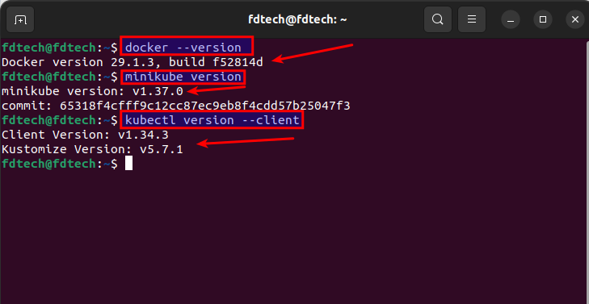
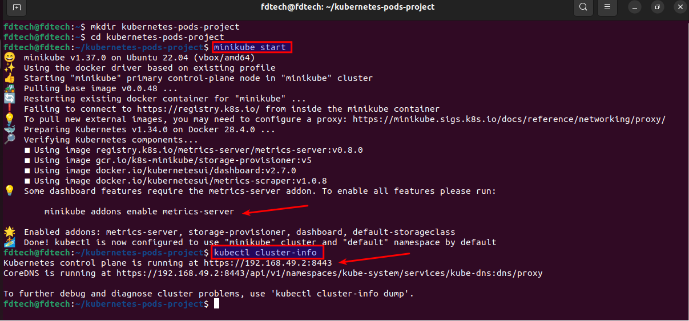
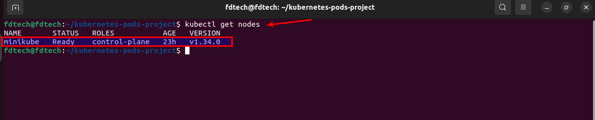
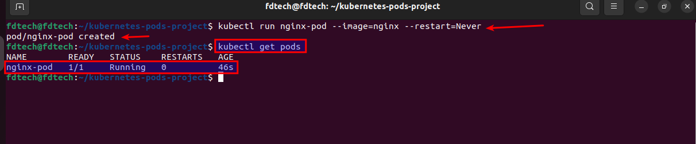
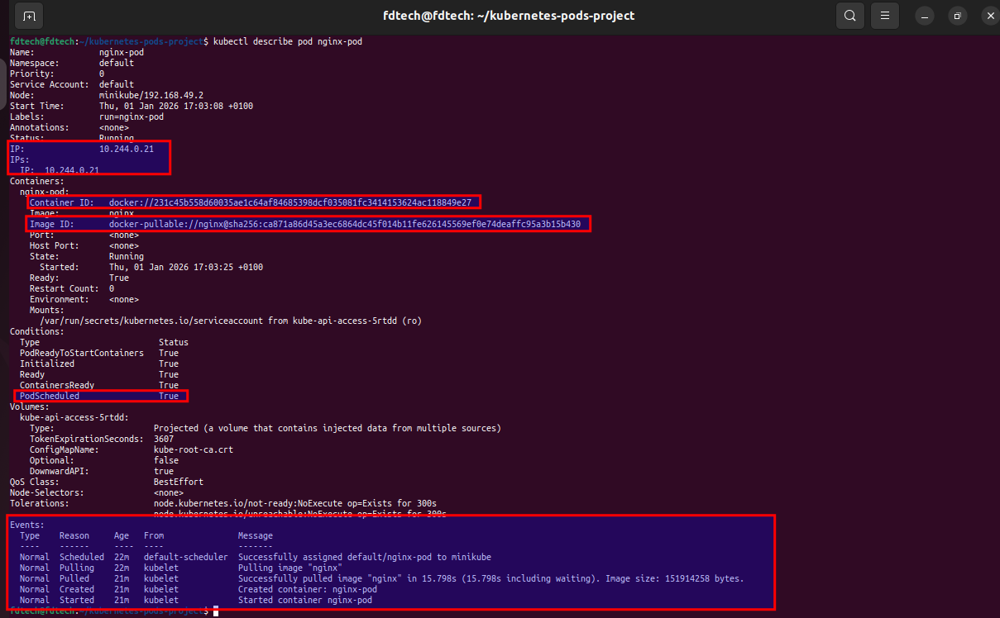
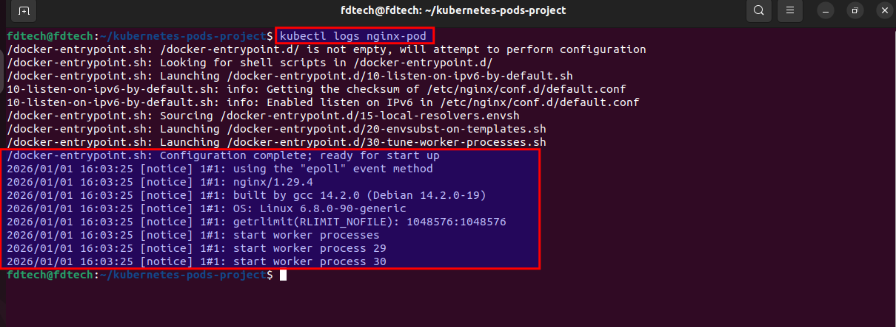
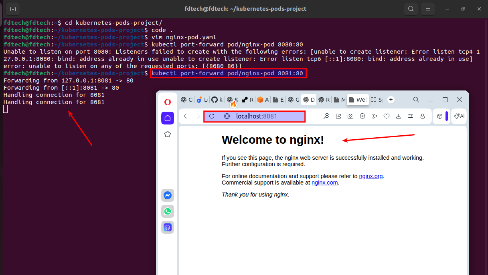
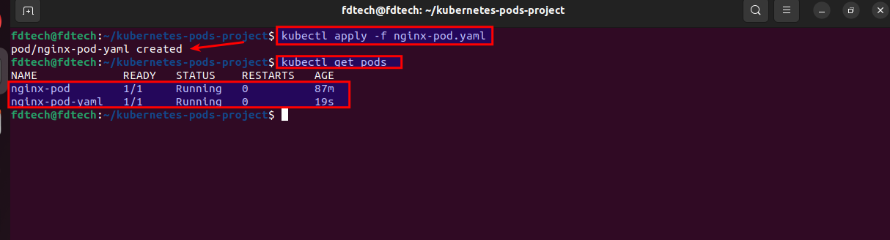
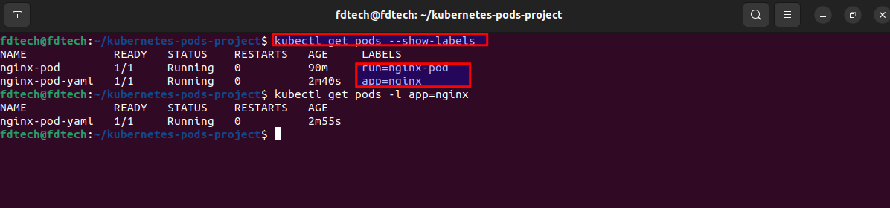
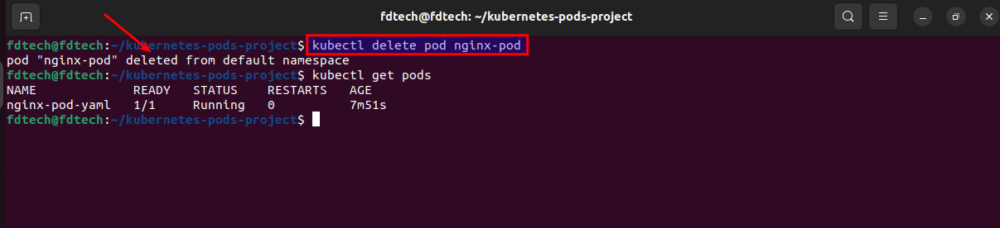
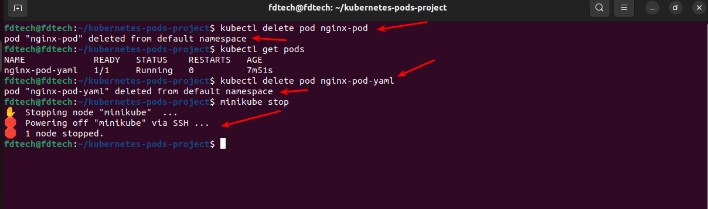
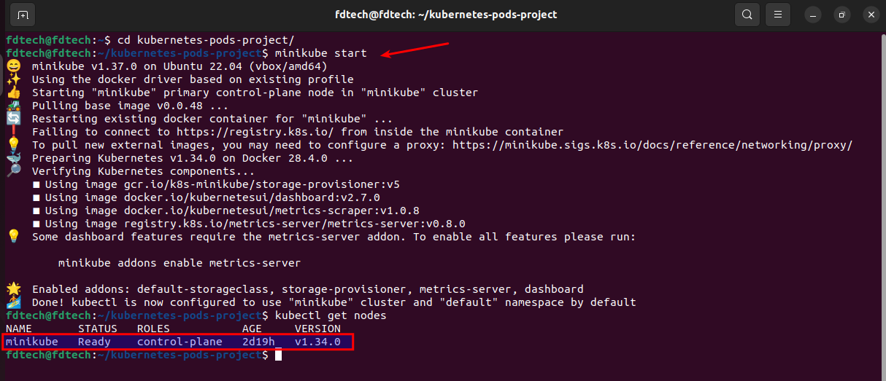
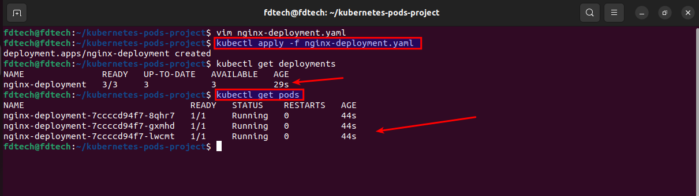
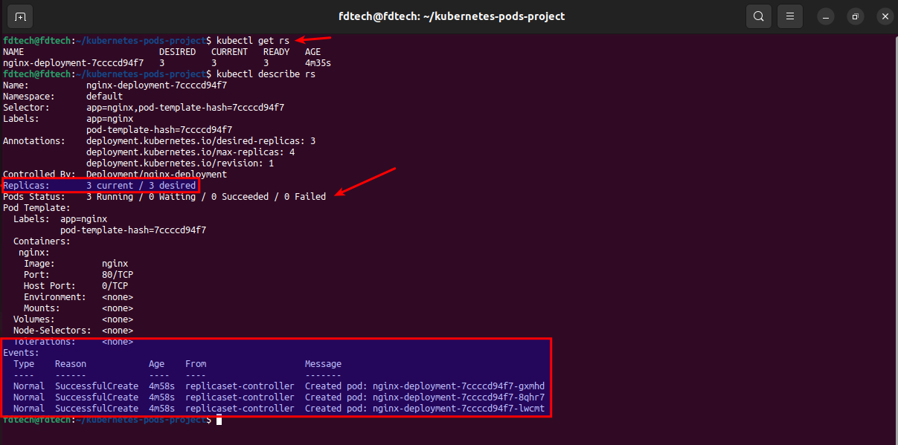
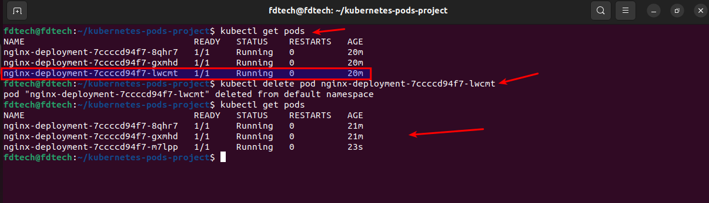
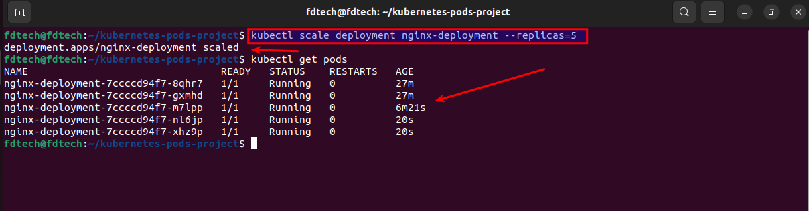
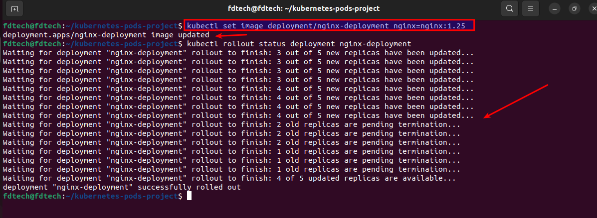

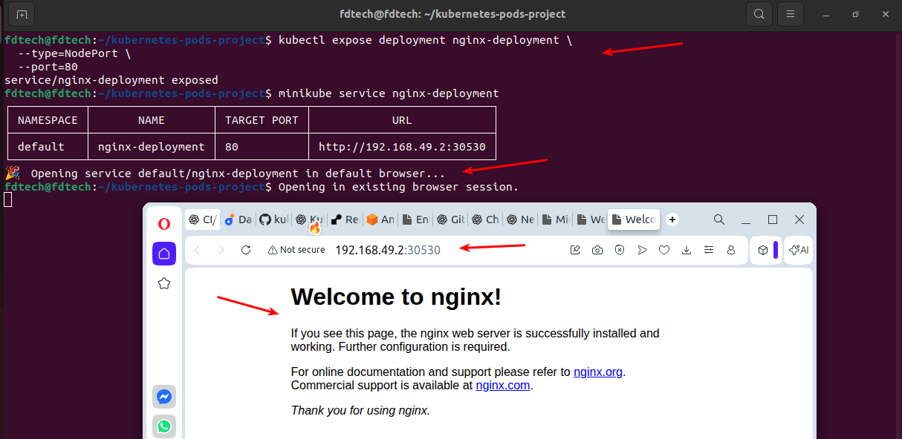
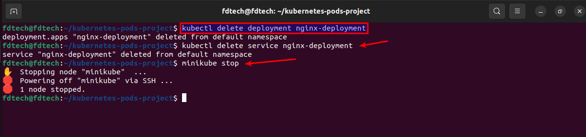